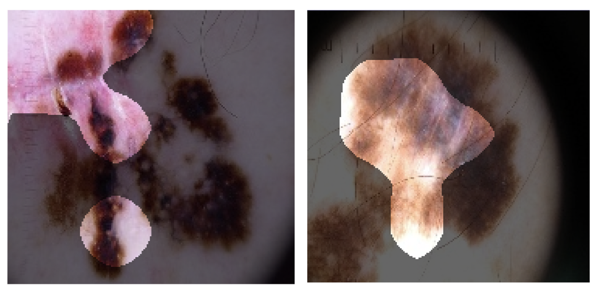

# CancerNet-SCa Open Source Initiative

**Note: The CancerNet-SCa models provided here are intended to be used as reference models that can be built upon and enhanced as new data becomes available. They are currently at a research stage and not yet intended as production-ready models (not meant for direct clinical diagnosis), and we are working continuously to improve them as new data becomes available. Please do not use CancerNet-SCa for self-diagnosis and seek help from your local health authorities.**

**CancerNet-SCa is part of the CancerNet initiatives, a parallel initiative to the [COVID-Net initiative](https://github.com/lindawangg/COVID-Net).**

	
	 
	<em>Example skin images from the ISIC dataset and their associated diagnostically relevant imaging features as identified by GSInquire using CancerNet-SCa-A. The bright regions indicate the imaging features identified to be relevant.</em>

Skin cancer continues to be the most frequently diagnosed form of cancer in the U.S., with not only significant effects on health and well-being but also significant economic costs associated with treatment. A crucial step to the treatment and management of skin cancer is effective skin cancer detection due to strong prognosis when treated at an early stage, with one of the key screening approaches being dermoscopy examination. Motivated by the advances of deep learning and inspired by the open source initiatives in the research community, in this study we introduce CancerNet-SCa, a suite of deep neural network designs tailored for the detection of skin cancer from dermoscopy images that is open source and available to the general public as part of the Cancer-Net initiative. To the best of the authors' knowledge, CancerNet-SCa comprises of the first machine-designed deep neural network architecture designs tailored specifically for skin cancer detection, one of which possessing a self-attention architecture design with attention condensers. Furthermore, we investigate and audit the behaviour of CancerNet-SCa in a responsible and transparent manner via explainability-driven model auditing. **By no means a production-ready solution**, the hope is that the release of CancerNet-SCa in open source, open access form will encourage researchers, clinicians, and citizen data scientists alike to leverage and build upon them.

For a detailed description of the methodology behind CancerNet-SCa and a full description of the dataset used, please click [here](https://arxiv.org/abs/2011.10702v1).

If you are a researcher or healthcare worker and you would like access to the **GSInquire tool to use to interpret CancerNet-SCa results** on your data or existing data, please reach out to a28wong@uwaterloo.ca or alex@darwinai.ca

Our desire is to encourage broad adoption and contribution to this project. Accordingly this project has been licensed under the GNU Affero General Public License 3.0. Please see [license file](LICENSE.md) for terms.

If there are any technical questions after the README, FAQ, and past/current issues have been read, please post an issue or contact:
* jamesrenhoulee@gmail.com
* mspavlova@uwaterloo.ca

## Quick Links
1. Main ISIC Archive: https://www.isic-archive.com/#!/topWithHeader/wideContentTop/main
2. CancerNet-SCa models: https://github.com/jamesrenhoulee/CancerNet-SCa/blob/main/docs/models.md

## Core CancerNet-SCa Team
* DarwinAI Corp., Canada and Vision and Image Processing Research Group, University of Waterloo, Canada
	* Alexander Wong
* Vision and Image Processing Research Group, University of Waterloo, Canada
	* James Lee
* DarwinAI Corp., Canada
	* Mahmoud Famouri
* University of Waterloo, Canada
	* Maya Pavlova

## Table of Contents
1. [Requirements](#requirements) to install, train, and infer CancerNet-SCa on your system.
2. Steps for [evaluation and inference](docs/train_eval_infer.md) of CancerNet-SCa.
3. [Results](#results)
4. [Links to pretrained models](docs/models.md)

## Requirements

The main requirements are listed below:

* Tensorflow 1.15
* OpenCV 4.2.0
* Python 3.6
* Numpy

Additional requirements to generate dataset:

* Pandas
* Jupyter

## Results

These are the final results for the CancerNet-SCa models on 221 malignant test images.

### CancerNet-SCa-A on ISIC test set

<table class="tg">
  <tr>
    <th class="tg-7btt" colspan="2">Sensitivity (%)</th>
  </tr>
  <tr>
    <td class="tg-7btt">Benign</td>
    <td class="tg-7btt">Malignant</td>
  </tr>
  <tr>
    <td class="tg-c3ow">74.7</td>
    <td class="tg-c3ow">92.8</td>
  </tr>
</table>

<table class="tg">
  <tr>
    <th class="tg-7btt" colspan="2">Positive Predictive Value (%)</th>
  </tr>
  <tr>
    <td class="tg-7btt">Benign</td>
    <td class="tg-7btt">Malignant</td>
  </tr>
  <tr>
    <td class="tg-c3ow">91.2</td>
    <td class="tg-c3ow">78.5</td>
  </tr>
</table>

### CancerNet-SCa-B on ISIC test set

<table class="tg">
  <tr>
    <th class="tg-7btt" colspan="2">Sensitivity (%)</th>
  </tr>
  <tr>
    <td class="tg-7btt">Benign</td>
    <td class="tg-7btt">Malignant</td>
  </tr>
  <tr>
    <td class="tg-c3ow">77.4</td>
    <td class="tg-c3ow">91.4</td>
  </tr>
</table>

<table class="tg">
  <tr>
    <th class="tg-7btt" colspan="2">Positive Predictive Value (%)</th>
  </tr>
  <tr>
    <td class="tg-7btt">Benign</td>
    <td class="tg-7btt">Malignant</td>
  </tr>
  <tr>
    <td class="tg-c3ow">90.0</td>
    <td class="tg-c3ow">80.2</td>
  </tr>
</table>

### CancerNet-SCa-C on ISIC test set

<table class="tg">
  <tr>
    <th class="tg-7btt" colspan="2">Sensitivity (%)</th>
  </tr>
  <tr>
    <td class="tg-7btt">Benign</td>
    <td class="tg-7btt">Malignant</td>
  </tr>
  <tr>
    <td class="tg-c3ow">77.8</td>
    <td class="tg-c3ow">90.0</td>
  </tr>
</table>

<table class="tg">
  <tr>
    <th class="tg-7btt" colspan="2">Positive Predictive Value (%)</th>
  </tr>
  <tr>
    <td class="tg-7btt">Benign</td>
    <td class="tg-7btt">Malignant</td>
  </tr>
  <tr>
    <td class="tg-c3ow">88.7</td>
    <td class="tg-c3ow">80.2</td>
  </tr>
</table>

